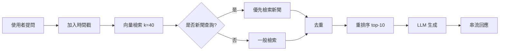

# TTU CSE Chatbot

大同大學資訊工程學系智能問答機器人 - 使用 RAG (Retrieval-Augmented Generation) 架構建構

[](https://fastapi.tiangolo.com/)
[](https://reactjs.org/)
[](https://vitejs.dev/)
[](https://tailwindcss.com/)

## 📋 目錄

- [功能特色](#功能特色)
- [專案結構](#專案結構)
- [技術棧](#技術棧)
- [系統需求](#系統需求)
- [快速開始](#快速開始)
- [啟動腳本](#啟動腳本)
- [API 文檔](#api-文檔)
- [RAG 架構](#rag-架構)
- [開發指南](#開發指南)
- [故障排除](#故障排除)

## ✨ 功能特色

### 核心功能
- 🤖 **RAG 問答系統**: 基於向量檢索的智能問答
- 📊 **多來源整合**: 整合系上新聞、課程資訊、成員資料等
- 🔄 **重排序機制**: 使用 BAAI/bge-reranker-base 提升檢索準確度
- 📅 **時間感知**: 自動加入當前日期（民國紀年）
- 🎯 **新聞優先**: 自動識別新聞相關查詢並優先檢索

### 使用者介面
- ✨ **SSE 串流**: 即時逐字顯示 AI 回應
- 📝 **Markdown 渲染**: 支援完整 Markdown 格式（標題、列表、程式碼、表格等）
- 🔐 **XSS 防護**: 使用 rehype-sanitize 保護使用者安全
- 📚 **來源追溯**: 可展開查看回答的資料來源（含相關度分數）
- 🎨 **現代化 UI**: Tailwind CSS 打造的美觀響應式介面
- 📱 **響應式設計**: 適配各種螢幕尺寸

## 📂 專案結構

```
ttu_cse_chatbot/
├── backend/                      # FastAPI 後端
│   ├── main.py                  # 主應用程式（RAG 實現）
│   ├── requirements.txt         # Python 依賴
│   ├── start_backend.ps1        # 後端啟動腳本（PowerShell）
│   └── start_backend.bat        # 後端啟動腳本（CMD）
├── frontend/                     # React + Vite 前端
│   ├── src/
│   │   ├── App.jsx             # 主要聊天介面
│   │   └── index.css           # Tailwind CSS
│   ├── package.json            # Node.js 依賴
│   ├── tailwind.config.js      # Tailwind 配置
│   ├── start_frontend.ps1      # 前端啟動腳本（PowerShell）
│   └── start_frontend.bat      # 前端啟動腳本（CMD）
├── data/                         # 原始資料檔案
│   ├── ttu_cse_news.sorted.json
│   ├── course_history_113.json
│   ├── department_members.json
│   └── ...
├── storage/                      # ChromaDB 向量資料庫
│   └── chroma/
├── venv/                         # Python 虛擬環境
├── start.ps1                     # 主啟動腳本（PowerShell）
├── start.bat                     # 主啟動腳本（CMD）
├── README.md                     # 本文件
├── ENVIRONMENT.md                # 環境配置說明
├── RAG_IMPLEMENTATION.md         # RAG 實現細節
└── MARKDOWN_RENDERING.md         # Markdown 功能說明
```

## 🛠 技術棧

### 後端
- **FastAPI 0.115.0+**: 現代化 Python Web 框架
- **Uvicorn**: ASGI 伺服器（含 websockets 和 httptools）
- **LangChain 0.3.0+**: RAG 框架
  - `langchain-ollama 0.2.0+`: Ollama LLM 整合
  - `langchain-chroma 0.1.0+`: ChromaDB 整合
  - `langchain-huggingface`: HuggingFace embeddings
- **ChromaDB 0.5.0+**: 向量資料庫
- **Sentence Transformers 3.0.0+**: 嵌入與重排序模型
  - Embeddings: `BAAI/bge-m3`
  - Reranker: `BAAI/bge-reranker-base`
- **Ollama**: 本地 LLM（qwen3:latest）

### 前端
- **React 18**: UI 框架
- **Vite 7.2.4**: 建構工具與開發伺服器
- **Tailwind CSS 3.4.18**: CSS 框架
  - `@tailwindcss/typography`: 排版插件
- **Markdown 渲染**:
  - `react-markdown`: Markdown 組件
  - `remark-gfm`: GitHub Flavored Markdown
  - `rehype-sanitize`: XSS 防護
- **EventSource API**: SSE 客戶端

### 開發工具
- **Python 3.12+**: 後端執行環境
- **Node.js 18+**: 前端執行環境
- **CUDA**: GPU 加速（可選，也支援 CPU）

## 📋 系統需求

### 必需
- Python 3.12 或更高版本
- Node.js 18 或更高版本
- 8GB RAM（最低）
- **已安裝並運行 Ollama**，且已下載 `qwen3:latest` 模型

### 推薦
- 16GB+ RAM
- NVIDIA GPU（用於 CUDA 加速）
- SSD 硬碟

### 檢查 Ollama 安裝
```powershell
# 檢查 Ollama 是否運行
ollama list

# 如果沒有 qwen3 模型，請執行
ollama pull qwen3:latest

# 測試模型
ollama run qwen3:latest
```

## 🚀 快速開始

### 第一次設置

#### 1. 克隆專案
```powershell
cd d:\畢業專題
git clone <repository-url> ttu_cse_chatbot
cd ttu_cse_chatbot
```

#### 2. 設置 Python 虛擬環境
```powershell
# 創建虛擬環境（如果還沒有）
python -m venv venv

# 激活虛擬環境
.\venv\Scripts\Activate.ps1

# 安裝後端依賴
pip install -r backend\requirements.txt
```

#### 3. 設置前端
```powershell
cd frontend
npm install
cd ..
```

#### 4. 確保資料庫存在
確保 `storage/chroma/` 目錄存在且已包含向量資料。如果沒有，需要先執行 `ingest.py` 建立資料庫：
```powershell
.\venv\Scripts\Activate.ps1
python ingest.py
```

### 啟動應用

#### 方式 1：使用一鍵啟動腳本（推薦）⭐

**PowerShell（推薦）:**
```powershell
.\start.ps1
```

**CMD:**
```cmd
start.bat
```

這會自動：
1. 在新視窗啟動後端（自動激活 venv）
2. 等待 3 秒
3. 在新視窗啟動前端

#### 方式 2：分別啟動前後端

**後端:**
```powershell
# PowerShell
.\backend\start_backend.ps1

# 或 CMD
backend\start_backend.bat

# 或手動
.\venv\Scripts\Activate.ps1
cd backend
python main.py
```

**前端:**
```powershell
# PowerShell
.\frontend\start_frontend.ps1

# 或 CMD
frontend\start_frontend.bat

# 或手動
cd frontend
npm run dev
```

### 訪問應用

- **前端 UI**: http://localhost:5173
- **後端 API**: http://localhost:8000
- **API 文檔**: http://localhost:8000/docs

## 📜 啟動腳本說明

### 主啟動腳本

| 檔案 | 用途 | Shell |
|------|------|-------|
| `start.ps1` | 一鍵啟動前後端（新視窗） | PowerShell |
| `start.bat` | 一鍵啟動前後端（新視窗） | CMD |

### 後端腳本

| 檔案 | 用途 | Shell |
|------|------|-------|
| `backend/start_backend.ps1` | 啟動後端（自動激活 venv） | PowerShell |
| `backend/start_backend.bat` | 啟動後端（自動激活 venv） | CMD |

**特點:**
- ✅ 自動激活 Python 虛擬環境 (venv)
- ✅ 自動切換到 backend 目錄
- ✅ 執行 `python main.py`

### 前端腳本

| 檔案 | 用途 | Shell |
|------|------|-------|
| `frontend/start_frontend.ps1` | 啟動前端開發伺服器 | PowerShell |
| `frontend/start_frontend.bat` | 啟動前端開發伺服器 | CMD |

**特點:**
- ✅ 自動切換到 frontend 目錄
- ✅ 執行 `npm run dev`

### 使用建議

1. **Windows PowerShell 使用者**（推薦）:
   - 使用 `.ps1` 腳本
   - 如遇到執行策略錯誤，執行: `Set-ExecutionPolicy -ExecutionPolicy RemoteSigned -Scope CurrentUser`

2. **CMD 使用者**:
   - 使用 `.bat` 腳本
   - 雙擊或在 CMD 中執行

## 📡 API 文檔

### GET `/`
健康檢查端點

**回應:**
```json
{
  "message": "TTU CSE Chatbot API is running"
}
```

### GET `/health`
健康狀態檢查

**回應:**
```json
{
  "status": "healthy",
  "rag_ready": true
}
```

### GET `/api/chat/stream`
SSE 串流聊天端點（用於前端即時顯示）

**參數:**
- `message` (query string): 使用者問題

**回應:** Server-Sent Events 串流
```
data: {"content": "你", "done": false}
data: {"content": "好", "done": false}
...
data: {"content": "", "done": true}
```

**範例:**
```javascript
const response = await fetch(
  `http://localhost:8000/api/chat/stream?message=${encodeURIComponent("資工系有哪些課程？")}`
);
```

### POST `/api/chat`
非串流聊天端點（用於獲取完整回應與來源）

**請求 Body:**
```json
{
  "message": "資工系有哪些課程？"
}
```

**回應:**
```json
{
  "response": "## 資工系課程\n\n大同大學資工系提供以下課程：\n\n1. **程式設計**\n2. **資料結構**\n...",
  "sources": [
    {
      "content": "課程內容摘要...",
      "source": "course_history_113.json",
      "relevance": 0.8523,
      "rerank_score": 0.9234
    }
  ]
}
```

## 🧠 RAG 架構

### 檢索流程



### 關鍵參數

| 參數 | 值 | 說明 |
|------|-----|------|
| `k_retrieve` | 40 | 初始檢索數量（k × 4） |
| `k` | 10 | 最終返回文件數 |
| `temperature` | 0 | LLM 溫度（確定性輸出） |
| `embeddings` | BAAI/bge-m3 | 嵌入模型 |
| `reranker` | BAAI/bge-reranker-base | 重排序模型 |
| `llm` | qwen3:latest | 語言模型 |

### 新聞檢測關鍵字
當查詢包含以下關鍵字時，會優先檢索新聞類型資料：
```python
["新聞", "消息", "news", "最新", "最近", "活動", 
 "說明會", "講座", "論壇", "營隊", "徵才"]
```

### 評分機制
每個檢索到的文件包含兩個分數：
- **relevance**: 向量相似度分數（0-1）
- **rerank_score**: 重排序分數（-∞ to +∞）

前端會顯示這兩個分數，幫助使用者了解來源可信度。

## 💻 開發指南

### 環境隔離

**後端（Python）- 使用 venv ✅**
```powershell
# 為什麼需要 venv？
✅ 隔離套件：避免不同專案的套件版本衝突
✅ 保護全域環境：不會汙染系統 Python
✅ 版本管理：每個專案可以使用不同版本的套件

# 套件安裝位置
✅ venv 環境：d:\畢業專題\ttu_cse_chatbot\venv\Lib\site-packages\
❌ 全域環境：C:\Users\User\AppData\Local\Programs\Python\Python312\Lib\site-packages\
```

**前端（Node.js）- 不需要 venv ✅**
```powershell
# npm 本身就有專案隔離機制
✅ 所有套件都安裝在專案的 node_modules/ 目錄
✅ 不會影響其他 Node.js 專案
```

### 修改後端

1. 確保在 venv 環境中：
```powershell
.\venv\Scripts\Activate.ps1
```

2. 修改 `backend/main.py`

3. 重啟後端伺服器（Uvicorn 會自動重載）

### 修改前端

1. 修改 `frontend/src/App.jsx` 或其他檔案

2. Vite 會自動熱重載（HMR）

### 添加新依賴

**後端:**
```powershell
.\venv\Scripts\Activate.ps1
pip install <package-name>
pip freeze > backend\requirements.txt
```

**前端:**
```powershell
cd frontend
npm install <package-name>
```

### CORS 配置

如需修改允許的前端來源，編輯 `backend/main.py`:
```python
app.add_middleware(
    CORSMiddleware,
    allow_origins=["http://localhost:5173", "http://localhost:3000"],  # 添加新來源
    allow_credentials=True,
    allow_methods=["*"],
    allow_headers=["*"],
)
```

## 🐛 故障排除

### 常見問題

#### 1. 後端啟動失敗："No module named 'xxx'"
**原因:** 未在 venv 環境中執行或依賴未安裝

**解決:**
```powershell
.\venv\Scripts\Activate.ps1
pip install -r backend\requirements.txt
```

#### 2. 前端啟動失敗："Cannot find module"
**原因:** Node.js 依賴未安裝

**解決:**
```powershell
cd frontend
npm install
```

#### 3. CUDA 錯誤："CUDA not available"
**原因:** 沒有 NVIDIA GPU 或 CUDA 未安裝

**解決:** 修改 `backend/main.py`，將所有 `device="cuda"` 改為 `device="cpu"`

#### 4. Ollama 連線失敗
**原因:** Ollama 服務未運行或模型未下載

**解決:**
```powershell
# 確保 Ollama 運行
ollama list

# 下載模型
ollama pull qwen3:latest

# 測試模型
ollama run qwen3:latest
```

#### 5. ChromaDB 錯誤："Collection not found"
**原因:** 向量資料庫未建立

**解決:**
```powershell
.\venv\Scripts\Activate.ps1
python ingest.py
```

#### 6. PowerShell 執行策略錯誤
**錯誤訊息:** "無法載入檔案 xxx.ps1，因為這個系統上已停用指令碼執行"

**解決:**
```powershell
Set-ExecutionPolicy -ExecutionPolicy RemoteSigned -Scope CurrentUser
```

#### 7. 前端顯示 "Failed to fetch"
**原因:** 後端未啟動或 CORS 配置錯誤

**檢查:**
1. 確認後端運行在 http://localhost:8000
2. 訪問 http://localhost:8000/health 檢查狀態
3. 檢查瀏覽器控制台的錯誤訊息

#### 8. Markdown 渲染異常
**原因:** rehype-sanitize 過濾了某些標籤

**解決:** 查看 `MARKDOWN_RENDERING.md` 中的配置說明

### 除錯模式

**後端除錯:**
```powershell
# 查看詳細日誌
cd backend
.\venv\Scripts\Activate.ps1
python main.py
```

**前端除錯:**
```powershell
# 開啟瀏覽器開發者工具（F12）
# 查看 Console 和 Network 標籤
cd frontend
npm run dev
```

## 📚 專案文檔

本 README.md 包含所有必要的專案資訊，包括：
- 完整的安裝與啟動指南
- 技術棧與架構說明
- RAG 實現細節
- API 文檔
- 故障排除指南

如需進一步了解 FastAPI 與 Vite 的詳細資訊，請參考官方文檔：
- [FastAPI 文檔](https://fastapi.tiangolo.com/)
- [Vite 文檔](https://vitejs.dev/)
- [React 文檔](https://react.dev/)
- [Tailwind CSS 文檔](https://tailwindcss.com/)

## 🎯 下一步開發

- [ ] 添加使用者認證系統
- [ ] 實作聊天歷史記錄（LocalStorage 或資料庫）
- [ ] 支援多輪對話上下文
- [ ] 添加檔案上傳功能（PDF、Word 等）
- [ ] 優化移動端 UI
- [ ] 實作搜尋歷史紀錄
- [ ] 添加主題切換（深色/淺色模式）
- [ ] 部署到生產環境
- [ ] 添加使用者回饋機制
- [ ] 整合更多資料來源

## 🤝 貢獻

此專案為大同大學資訊工程學系畢業專題。

## 📄 授權

此專案為大同大學資訊工程學系畢業專題，僅供學術研究使用。

---

**製作團隊:** 大同大學資訊工程學系  
**最後更新:** 2025年11月21日
